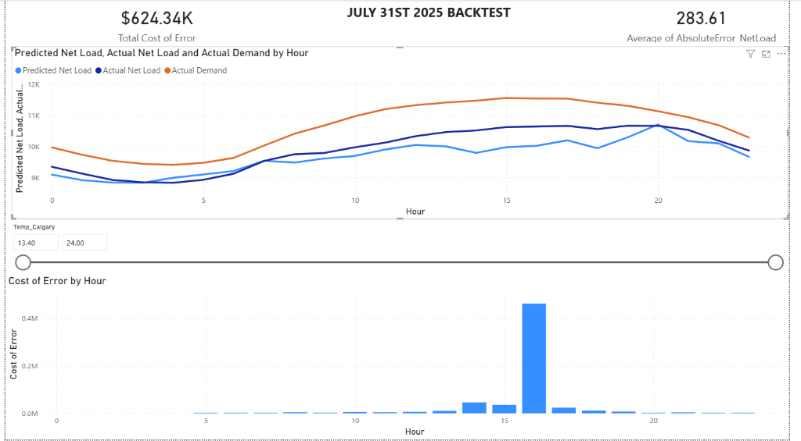
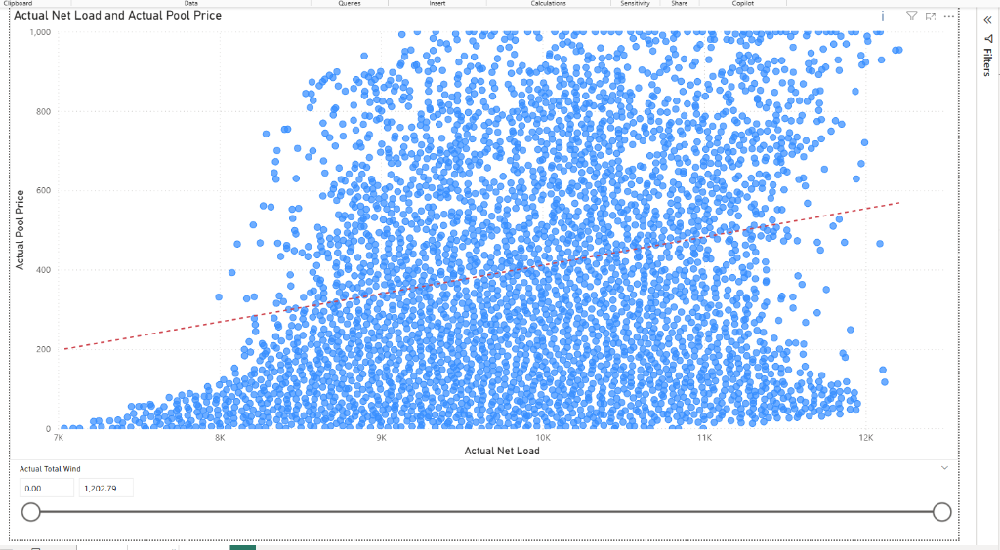
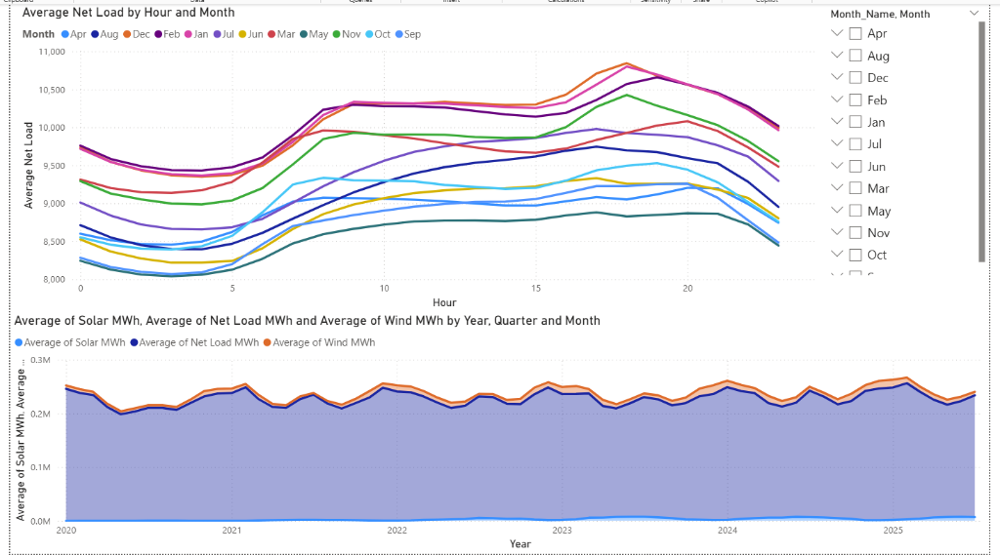

# Alberta Electric Grid: Net Load & Operational Risk Forecasting
### Leveraging XGBoost & Multi-Location Weather Data for Natural Gas Risk Mitigation

## Project Objective
The goal of this project is to optimize Net Load forecasting for the Alberta electricity grid (AESO). Net Load (Total Demand minus Renewables) represents the amount of power that must be generated by traditional sources like Natural Gas. 

Accurately predicting this dependency 24 hours in advance allows grid operators to minimize financial risk from price spikes and maintain operational stability by ensuring thermal generators have sufficient lead time.

---

## Technical Stack
- **Data Engineering**: Python (Pandas, NumPy)
- **Machine Learning**: XGBoost Regressor
- **Data Sourcing**: AESO Public Datasets & Open-Meteo Historical Weather API
- **Visualization**: Power BI

---

## Dashboard Analysis
The associated Power BI dashboard provides a detailed breakdown of grid performance and forecasting accuracy.

### 1. Day-Ahead Backtest (Performance & Financial Impact)

*   **Performance Insight**: This view shows the model following the actual Net Load curve throughout the day. Despite a small "visual" error between hours 15 and 18, the model maintains a strong overall MAPE of ~2.8%.
*   **The "Cost of Error" Spike**: The bottom bar chart reveals the most critical insight: a 600 MW error at Hour 16 costs over $400k. This proves that **operational timing** is more important than raw MW accuracy. Missing a peak during high-price hours creates massive financial exposure for the grid.

### 2. Market Sensitivity: Price vs. Net Load Correlation

*   **Positive Correlation**: The scatter plot confirms a direct positive correlation between Net Load and Pool Price (indicated by the red trend line). As Net Load increases, the grid is forced to use more expensive "Peaker" gas plants, driving prices up.
*   **Operational Risk**: The high density of dots in the 10k–12k MW range shows where the market becomes most volatile. Forecasting accuracy in this "high-stress" zone is the primary goal of the XGBoost model to prevent unhedged exposure to $500+/MWh prices.

### 3. The "Duck Curve" & Long-Term Trends

*   **The Evolving Duck Curve**: The line chart shows the hourly average Net Load by month. The "belly" of the curve (midday) is sinking lower every year as more solar capacity is added to the Alberta grid.
*   **The Ramp Risk**: The steep climb in Net Load between 5 PM and 9 PM (the "neck" of the duck) represents the highest risk period for natural gas generators. They must ramp up several thousand MWs in just a few hours as solar disappears, making accurate day-ahead forecasting essential for grid stability.

---

## Development Methodology: Localized Weather Integration
Initial iterations used Calgary weather data as a provincial proxy, which proved insufficient for wind farm clusters located in southern and eastern Alberta. 

The pipeline was re-engineered to ingest localized weather data (Temperature, Wind Speed, and Solar Irradiance) from four specific coordinates:
- **Pincher Creek**: High-density wind cluster.
- **Medicine Hat**: High-density solar cluster.
- **Provost**: Eastern corridor wind/weather data.
- **Calgary**: Central grid load proxy.

This change stabilized the model's performance and improved the Mean Absolute Error for wind predictions.

---

## Performance Metrics
Results for validation day July 31, 2025:

| Metric | Result |
| :--- | :--- |
| **MAPE (Net Load)** | **~2.8%** |
| **Demand R²** | **0.71** |
| **MAE (Net Load)** | **283 MW** |
| **Solar R²** | **0.91** |
| **Wind R² (Historical Benchmark)** | **~0.23** |
| **Wind R² (Single Day Validation)** | **-0.19** |

*Note: The negative Wind R-squared for the single-day validation is an expected mathematical result of evaluating a volatile variable on a low-variance day. Mean Absolute Error (MAE) is utilized as the primary operational metric for daily forecasting.*

---

## How to Run
1. Point the `FILE_PATH` in `AESO_proj.py` to the local AESO dataset.
2. Execute the script to export the validation and Power BI tables to the Desktop.
3. Refresh the Power BI dashboard connections to update the visualizations.
